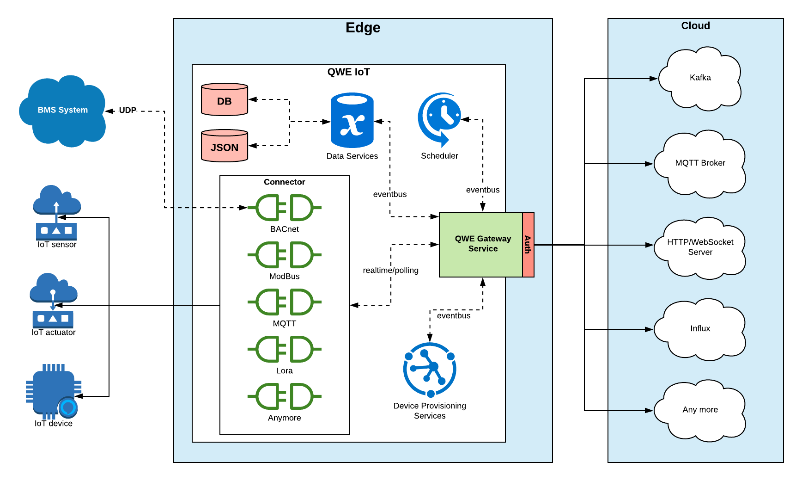
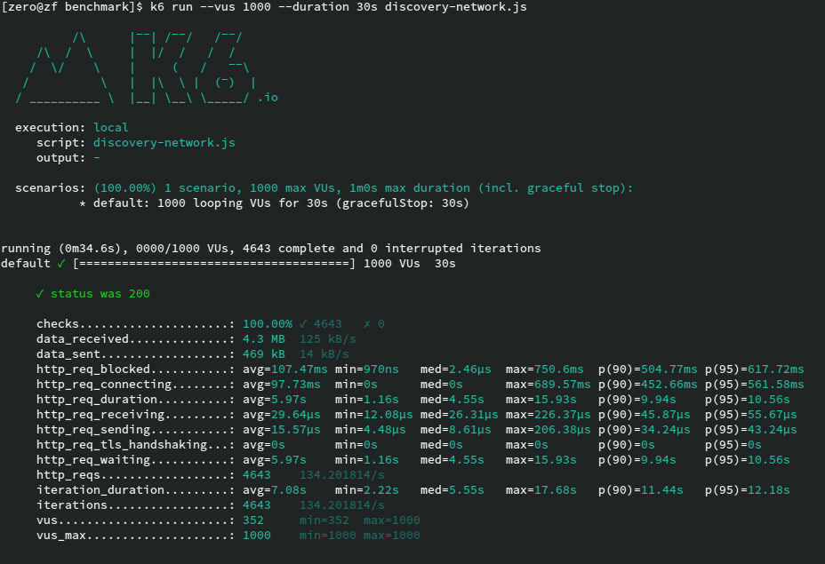

# qwe-iot-gateway

[IoT Gateway](https://openautomationsoftware.com/open-automation-systems-blog/what-is-an-iot-gateway) for `Machine-to-Machine` and `Machine-to-Cloud`

## Overview

## Benchmark

Simple HTTP server benchmark on [Raspberry-pi-3](https://www.raspberrypi.org/products/raspberry-pi-3-model-b/)

## References

Inspired by `Event Driven architecuture`. Core module in [`QWE`](https://github.com/zero88/qwe)
